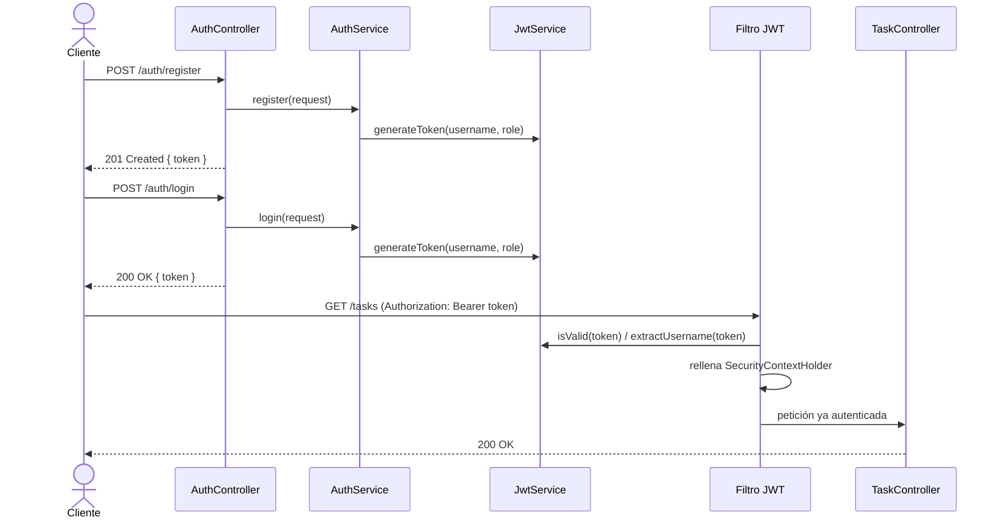

# Autenticación con JWT

Un **JWT** (JSON Web Token) es un token firmado que contiene información (*claims*) sobre quién es el usuario. A diferencia de una sesión de servidor, el propio token lleva la prueba de identidad — el servidor no necesita guardar nada para verificarlo, solo comprobar la firma. Esta fase usa un JWT **propio**: lo emite y lo valida la misma aplicación, sin depender de un proveedor externo (Keycloak, Auth0...).

El flujo completo, de principio a fin:



El registro y el login emiten el token de la misma forma (`JwtService.generateToken`) — la única diferencia entre ambos es si el usuario se crea (`register`) o ya existía (`login`). De ahí en adelante, cada petición protegida repite el mismo patrón: el cliente manda el token en el header `Authorization`, el filtro lo valida y rellena el contexto de seguridad **antes** de que la petición llegue al controlador — el controlador nunca ve el token en sí, solo un usuario ya autenticado.

## El controlador solo delega

```java
@RestController
public class AuthController {

    private final AuthService authService;

    public AuthController(AuthService authService) {
        this.authService = authService;
    }

    @PostMapping("/auth/register")
    public ResponseEntity<AuthResponse> register(@Valid @RequestBody RegisterRequest request) {
        return ResponseEntity.status(HttpStatus.CREATED).body(authService.register(request));
    }

    @PostMapping("/auth/login")
    public AuthResponse login(@Valid @RequestBody LoginRequest request) {
        return authService.login(request);
    }
}
```

`AuthController` no toca `UserRepository`, ni `PasswordEncoder`, ni `JwtService`: valida la entrada (`@Valid`), llama al servicio y decide el código HTTP (201 en el registro). Es la misma regla de [Capas: controller → service → repository](/docs/01-fundamentos/capas) que ya sigue `TaskController` — que la autenticación tenga que ver con seguridad no la convierte en una excepción. Comprobar si el usuario ya existe, codificar la contraseña, guardarlo y emitir el token son reglas de negocio, y viven en `AuthServiceImpl`, donde además `@Transactional` agrupa la comprobación y el guardado en una sola transacción.

## Registro

```java
@Override
@Transactional
public AuthResponse register(RegisterRequest request) {
    if (userRepository.existsByUsername(request.username())) {
        throw new UsernameAlreadyExistsException(request.username());
    }
    User user = new User(request.username(), passwordEncoder.encode(request.password()), Role.USER);
    userRepository.save(user);
    return new AuthResponse(jwtService.generateToken(user.getUsername(), user.getRole()));
}
```

Todo usuario nuevo nace con rol `USER` — no existe una forma de auto-asignarse `ADMIN` vía el API (el único `ADMIN` inicial lo siembra una migración de Flyway, ver [Probar endpoints protegidos](./probar-endpoints-protegidos)). La contraseña nunca se guarda tal cual: pasa por `passwordEncoder.encode(...)` antes de llegar a la base de datos.

## Login

```java
@Override
@Transactional(readOnly = true)
public AuthResponse login(LoginRequest request) {
    authenticationManager.authenticate(
            new UsernamePasswordAuthenticationToken(request.username(), request.password()));
    User user = userRepository.findByUsername(request.username())
            .orElseThrow(() -> new IllegalStateException("Usuario autenticado pero no encontrado"));
    return new AuthResponse(jwtService.generateToken(user.getUsername(), user.getRole()));
}
```

`authenticationManager.authenticate(...)` es el mismo mecanismo que Spring Security monta automáticamente a partir de `UserDetailsServiceImpl` y `PasswordEncoder` (ver [Spring Security básico](./spring-security-basico)): busca el usuario, compara el hash, y si algo no cuadra lanza `BadCredentialsException` — con el mismo mensaje genérico tanto si el usuario no existe como si la contraseña es incorrecta, para no revelar qué usernames están registrados.

## Firmar el token

```java
@Service
public class JwtService {

    private final SecretKey signingKey;
    private final long expirationMillis;

    public JwtService(
            @Value("${app.jwt.secret}") String secret,
            @Value("${app.jwt.expiration-millis}") long expirationMillis) {
        this.signingKey = Keys.hmacShaKeyFor(secret.getBytes());
        this.expirationMillis = expirationMillis;
    }

    public String generateToken(String username, Role role) {
        Date now = new Date();
        Date expiration = new Date(now.getTime() + expirationMillis);
        return Jwts.builder()
                .subject(username)
                .claim("role", role.name())
                .issuedAt(now)
                .expiration(expiration)
                .signWith(signingKey)
                .compact();
    }
    // ...
}
```

Usamos la librería [`jjwt`](https://github.com/jwtk/jjwt) para construir y firmar el token con una clave HMAC (simétrica: la misma clave firma y verifica, guardada en `application.yml` como `app.jwt.secret`, nunca en el código). El `subject` es el username; el claim `"role"` viaja también en el token, pero es solo informativo — como verás en [Roles y autorización](./roles-y-autorizacion), la autorización real no confía en ese claim.

:::caution[Secreto en un proyecto real]
Que el secreto no esté escrito en el código Java no basta: no debe llegar tampoco en texto plano al repositorio. El `application.yml` de este ejemplo lo define como `secret: "${JWT_SECRET:local-dev-secret-please-change-in-production-0123456789abcdef}"` — la sintaxis `${VAR:valor-por-defecto}` de Spring lee la variable de entorno `JWT_SECRET` si existe, y solo cae al valor local de desarrollo cuando no se define. En un despliegue real, `JWT_SECRET` se inyecta desde el entorno (o un gestor de secretos) y nunca se comitea.
:::

## Validar el token en cada petición

Un filtro propio, dentro de la cadena de filtros de Spring Security, lee el token de cada petición antes de que se decida si puede pasar:

```java
@Component
public class JwtAuthenticationFilter extends OncePerRequestFilter {

    @Override
    protected void doFilterInternal(HttpServletRequest request, HttpServletResponse response,
            FilterChain filterChain) throws ServletException, IOException {

        String header = request.getHeader("Authorization");
        if (header != null && header.startsWith("Bearer ")) {
            String token = header.substring("Bearer ".length());
            try {
                if (jwtService.isValid(token)) {
                    String username = jwtService.extractUsername(token);
                    UserDetails userDetails = userDetailsService.loadUserByUsername(username);
                    var authentication = new UsernamePasswordAuthenticationToken(
                            userDetails, null, userDetails.getAuthorities());
                    SecurityContextHolder.getContext().setAuthentication(authentication);
                }
            } catch (UsernameNotFoundException ignored) {
                // token válido pero usuario ya no existe: se trata como no autenticado
            }
        }

        filterChain.doFilter(request, response);
    }
}
```

`OncePerRequestFilter` garantiza que el filtro corre exactamente una vez por petición. Si el header `Authorization` trae un `Bearer <token>` válido, el filtro rellena el `SecurityContextHolder` — de ahí en adelante, para el resto de la petición (controllers incluidos), Spring Security actúa como si el usuario se hubiera autenticado de la forma tradicional. Si no hay token, o es inválido, simplemente no se rellena nada y la petición sigue: será `authorizeHttpRequests` (o `@PreAuthorize`) quien la rechace más adelante si el endpoint requería autenticación.

Registrado en `SecurityConfig` con `addFilterBefore(jwtAuthenticationFilter, UsernamePasswordAuthenticationFilter.class)`. Ese `UsernamePasswordAuthenticationFilter` no está realmente en la cadena de filtros en este proyecto — nunca se activa (`SecurityConfig` no llama a `formLogin()`), así que su clase solo se usa aquí como punto de referencia de orden ("mi filtro corre antes de donde iría ese filtro, si existiera"), no porque intervenga en ninguna petición. El login (`/auth/login`) tampoco pasa por él: va directo a través de `authenticationManager.authenticate(...)` dentro de `AuthServiceImpl`.
