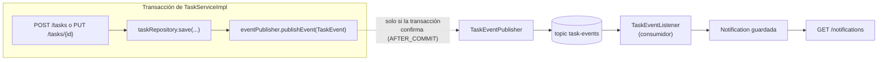

# Productores y eventos

Cuando se crea o se completa una tarea, se publica un mensaje al topic `task-events`. Antes de ver el código del productor, la pregunta que importa: ¿en qué momento exacto se envía ese mensaje?

El flujo completo, de punta a punta:



La línea punteada es la parte que importa: `TaskEvent` se publica *dentro* de la transacción (`C`), pero el salto a Kafka (`D`) solo ocurre si esa transacción confirma — nunca antes, nunca si hace rollback. Todo lo que está a la derecha de esa línea (el consumidor, la notificación, el endpoint) vive en un proceso lógicamente separado del que atendió la petición HTTP original.

## El problema de publicar demasiado pronto

```java
@Transactional
public TaskResponse create(TaskRequest request, User currentUser) {
    Task task = new Task(request.titulo(), request.descripcion(), request.completada(), currentUser);
    Task saved = taskRepository.save(task);
    kafkaTemplate.send("task-events", ...); // <- tentador, pero incorrecto aquí
    return TaskResponse.from(saved);
}
```

`@Transactional` no confirma la transacción hasta que el método `create` termina de ejecutarse por completo — el `save` de arriba todavía puede deshacerse si algo falla más adelante en el mismo método, o incluso después, según cómo esté configurado el framework alrededor. Si `kafkaTemplate.send(...)` se llama directamente ahí, y la transacción termina haciendo rollback, un consumidor ya habría reaccionado a la creación de una tarea que, en la base de datos, nunca llegó a existir. Es la misma clase de problema que ya se vio con `@CacheEvict` en la Fase 4: una acción con efecto hacia afuera (Kafka, caché) tiene que esperar a que la transacción de base de datos confirme de verdad.

## La solución: evento interno + `AFTER_COMMIT`

```java
// dentro de TaskServiceImpl, todavía en la transacción:
eventPublisher.publishEvent(new TaskEvent(
        saved.getId(), TaskEventType.CREATED, saved.getTitulo(), currentUser.getUsername(), Instant.now()));
```

```java
@Component
public class TaskEventPublisher {

    private final KafkaTemplate<String, TaskEvent> kafkaTemplate;

    public TaskEventPublisher(KafkaTemplate<String, TaskEvent> kafkaTemplate) {
        this.kafkaTemplate = kafkaTemplate;
    }

    @TransactionalEventListener(phase = TransactionPhase.AFTER_COMMIT)
    public void onTaskEvent(TaskEvent event) {
        kafkaTemplate.send("task-events", event.taskId().toString(), event);
    }
}
```

`TaskServiceImpl` publica un `TaskEvent` como evento de aplicación de Spring — algo puramente interno, que no sale del proceso ni se serializa a ningún sitio. `TaskEventPublisher`, un `@Component` aparte, escucha ese mismo evento con `@TransactionalEventListener(phase = AFTER_COMMIT)`: Spring garantiza que este método solo se ejecuta **si y cuando** la transacción que publicó el evento confirma. Si hay un rollback, `onTaskEvent` nunca se ejecuta, y ningún mensaje llega a Kafka.

Una advertencia sobre `@TransactionalEventListener`: si no hay ninguna transacción activa en el momento en que se publica el evento, el listener no hace nada, silenciosamente — `fallbackExecution` es `false` por defecto. Aquí no es un problema porque tanto `create` como `update` en `TaskServiceImpl` son `@Transactional`, pero es la trampa clásica de este patrón para quien lo reutilice en otro sitio sin una transacción alrededor.

## `TaskEvent`: el mensaje real

```java
public record TaskEvent(Long taskId, TaskEventType eventType, String titulo, String ownerUsername, Instant timestamp) {
}
```

`ownerUsername` es el dueño de la tarea, no necesariamente quien hizo la petición HTTP. Al crear una tarea eso es lo mismo — pero al completarla no siempre: un `ADMIN` puede completar una tarea ajena (`PUT /tasks/{id}` de otro usuario), y la notificación resultante tiene que llegar a quien es dueño de la tarea, no al admin que la disparó:

```java
if (!wasCompleted && saved.isCompletada()) {
    eventPublisher.publishEvent(new TaskEvent(
            saved.getId(), TaskEventType.COMPLETED, saved.getTitulo(), saved.getUser().getUsername(), Instant.now()));
}
```

`wasCompleted` se captura *antes* de aplicar los cambios del request — la condición `!wasCompleted && saved.isCompletada()` es la regla completa: un evento `COMPLETED` se publica únicamente en la transición de `false` a `true`, nunca al crear una tarea ya completada (eso ya es un `CREATED`), y nunca en una actualización repetida de una tarea que ya estaba completada.

## La clave del mensaje no es cosmética

`kafkaTemplate.send("task-events", event.taskId().toString(), event)` — el segundo argumento es la clave. Kafka garantiza orden solo dentro de una misma partición, y usar el id de la tarea como clave asegura que todos los eventos de una tarea concreta (su creación, luego su completado) caen siempre en la misma partición y se procesan en el orden en que ocurrieron.

## `max.block.ms`: por qué Kafka no puede colgar una respuesta HTTP

`onTaskEvent` llama a `kafkaTemplate.send(...)` de forma síncrona, en el mismo hilo que está a punto de devolver la respuesta HTTP — no hay ningún `@Async` de por medio. Eso significa que, si Kafka no responde, ese `send()` puede quedarse bloqueado esperando metadata del broker, y por defecto Kafka permite que esa espera dure hasta 60 segundos. Sin acotarla, una caída de Kafka dejaría de ser solo "no llegan las notificaciones" y pasaría a ser "las peticiones HTTP normales tardan un minuto en responder", aunque crear o completar una tarea no tenga nada que ver con Kafka en sí.

Por eso el `producerFactory` en `KafkaConfig.java` fija explícitamente `ProducerConfig.MAX_BLOCK_MS_CONFIG`:

```java
@Bean
public ProducerFactory<String, TaskEvent> producerFactory(
        @Value("${spring.kafka.bootstrap-servers}") String bootstrapServers) {
    Map<String, Object> props = new HashMap<>();
    props.put(ProducerConfig.BOOTSTRAP_SERVERS_CONFIG, bootstrapServers);
    props.put(ProducerConfig.KEY_SERIALIZER_CLASS_CONFIG, StringSerializer.class);
    props.put(ProducerConfig.VALUE_SERIALIZER_CLASS_CONFIG, JacksonJsonSerializer.class);
    // TaskEventPublisher.onTaskEvent (AFTER_COMMIT) llama a send() de forma síncrona, en
    // el mismo hilo de la petición HTTP. Sin este límite, send() puede bloquear ese hilo
    // hasta el default de Kafka (60s) esperando metadata si el broker no responde —
    // acotado aquí para que una caída de Kafka nunca cuelgue una respuesta HTTP más de
    // unos segundos.
    props.put(ProducerConfig.MAX_BLOCK_MS_CONFIG, 3000);
    return new DefaultKafkaProducerFactory<>(props);
}
```

Con `MAX_BLOCK_MS_CONFIG` en 3000, el bloqueo máximo pasa de un minuto a tres segundos. Es exactamente lo que hace honesta la afirmación del perfil `h2`/sin Docker (ver el README de la fase): "la app sigue respondiendo aunque no haya Kafka" no es una propiedad automática de este diseño — es una consecuencia directa de este límite. Sin él, esa frase sería falsa en cualquier escenario donde Kafka esté configurado pero inalcanzable.

Ese límite acota el bloqueo, pero no resuelve qué pasa si el envío termina fallando de verdad — no solo tardando, sino fallando — después de esos tres segundos. `onTaskEvent` ignora el `CompletableFuture` que devuelve `kafkaTemplate.send(...)`, así que un fallo real se registra como error (por el `LoggingProducerListener` que trae Spring Kafka por defecto) y el evento se pierde en silencio: la tarea queda creada en la base de datos, pero nadie se entera. Es una limitación real del patrón `AFTER_COMMIT` tal como está aquí — a veces se le llama el **dual write problem**: el commit en base de datos y la publicación en Kafka son dos operaciones separadas, sin ninguna garantía atómica entre ambas. La respuesta de producción a este problema tiene nombre propio, el **transactional outbox**, y queda fuera del alcance de esta fase — pero vale la pena saber que existe antes de asumir que este código es la última palabra sobre el tema.
