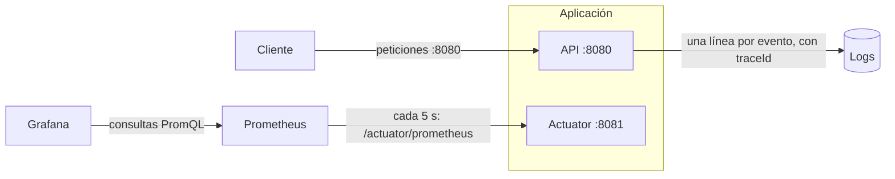

# Producción

Hasta ahora sabíamos que la API funcionaba porque los tests pasaban. En producción no hay ningún test mirando: la aplicación tiene que contar ella misma cómo está, qué hace y cómo se usa. Esta fase no añade funcionalidad al API de tareas; le añade eso.

- **¿Está viva y puede atender tráfico?** Actuator y sus health checks.
- **¿Cuántas peticiones recibe, cuánto tardan, cuántas fallan?** Métricas con Micrometer, recogidas por Prometheus y dibujadas en Grafana.
- **¿Qué pasó exactamente en la petición que falló?** Logs estructurados con un `traceId` por petición.
- **¿Cómo se usa?** Documentación OpenAPI generada desde el propio código.

## Contenido

1. [Actuator](./actuator)
2. [Métricas con Micrometer y Prometheus](./metricas)
3. Logs y trazas
4. OpenAPI con springdoc
5. ¿Está lista para producción?

## Cómo encaja todo



La API y Actuator escuchan en puertos distintos. El 8080 es el que se publica; el 8081 solo lo ven Prometheus y los chequeos de la plataforma donde corre la aplicación.

## Ejemplo ejecutable

Todo el código de esta fase vive en [`examples/07-observabilidad`](https://github.com/HarolRiosDev/spring-boot-docs/tree/main/examples/07-observabilidad): el mismo API de tareas con auth JWT y caché de la Fase 6.

```bash
cd examples/07-observabilidad
docker compose up -d        # Postgres, Redis, Prometheus y Grafana
./mvnw spring-boot:run
```

| Dónde mirar | URL |
|---|---|
| Swagger UI | http://localhost:8080/swagger-ui.html |
| Estado de la app | http://localhost:8081/actuator/health |
| Métricas en crudo | http://localhost:8081/actuator/prometheus |
| Grafana | http://localhost:3001 |

Sin Docker, `SPRING_PROFILES_ACTIVE=h2 ./mvnw spring-boot:run` arranca la app con H2 y caché en memoria: Actuator y Swagger UI funcionan; Prometheus y Grafana no.
